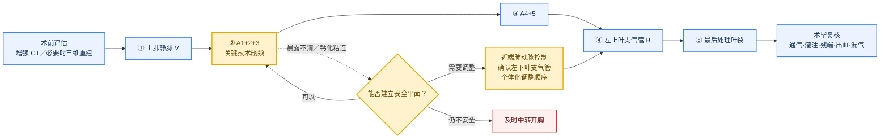

# 左上肺叶切除：单孔单向式要点

> 本笔记采用的标准路径为：**V → A1+2+3 → A4+5 → B → 叶裂**。实际操作应结合血管变异、叶裂发育、淋巴结钙化及术中暴露情况调整，安全优先于固定顺序。

## 一、术前判断

- 结合增强 CT，必要时行三维重建，确认上肺静脉、A1+2+3、A4+5及常见血管变异。
- 重点评估叶裂发育、肺门粘连或钙化淋巴结，以及建立近端肺动脉控制的可行性。

## 手术顺序示意图

> 蓝色为标准流程，黄色为关键判断，红色为安全退出路径。

## 二、标准路径

| 步骤 | 核心要点 |
|---|---|
| 上肺静脉（V） | 明确上下肺静脉关系，保护下肺静脉；按实际分支解剖处理。 |
| A1+2+3 | 本术式的关键步骤。直视下充分显露，困难时先建立近端肺动脉控制，再按解剖分支处理。 |
| A4+5 | 本笔记置于 A1+2+3 之后处理；追踪其起源，警惕变异及下叶肺动脉损伤。 |
| 左上叶支气管（B） | 击发前确认左下叶支气管及通气，避免误夹或狭窄。 |
| 叶裂 | 采用 fissure-last 思路，最后完成叶裂，减少反复翻转和肺漏气。 |

## 三、困难情况处理

- A1+2+3 暴露不清或存在钙化粘连时，应停止盲目分离，重新调整牵引、视野和入路。
- 仅在完成近端肺动脉控制并确认左下叶支气管后，才可根据具体解剖个体化调整顺序，包括先处理支气管。
- 不应将未确认的肺动脉与钙化组织盲目整块击发。
- 无法建立安全分离平面、出血难以控制或解剖关系不清时，应及时中转开胸。

## 四、淋巴结与术毕复核

- 淋巴结处理应依据肿瘤位置、临床分期及现行规范决定，不宜机械固定站数。
- 完成前复核：左下叶通气与灌注、血管及支气管残端、活动性出血、漏气和切除标本对应关系。

## 最终结论

**标准顺序为 V → A1+2+3 → A4+5 → B → 叶裂，其中 A1+2+3 是主要技术瓶颈。手术重点不是机械遵循顺序，而是在解剖明确、近端可控的前提下由浅入深处理；遇到钙化粘连或解剖不清时，应及时调整路径或中转，避免盲目分离和击发。**

