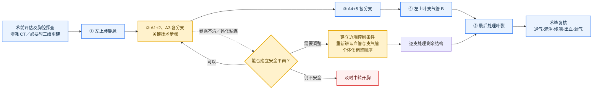

# 左上肺叶切除：单孔单向式要点

> 本笔记记录一种静脉优先、叶裂最后的单向路径：**左上肺静脉 → A1+2、A3 → A4+5 → 左上叶支气管 → 叶裂**。单向式强调沿相对连续的解剖方向由浅入深推进，并非唯一标准顺序；实际操作应根据血管变异、叶裂发育、钙化粘连和术中暴露调整。参见[单孔左上叶切除出口优先技术](https://pmc.ncbi.nlm.nih.gov/articles/PMC11067216/)。

## 一、术前判断

- 结合增强 CT，必要时行三维重建，确认上下肺静脉关系，以及 A1+2、A3、A4+5 的分支与变异；影像重建不能替代术中确认。左上叶肺动脉常为多支供血，参见[左上叶肺动脉分支系统综述](https://pmc.ncbi.nlm.nih.gov/articles/PMC12985616/)。
- 重点评估叶裂发育、胸腔及肺门粘连、钙化淋巴结、病灶可切除性，以及建立近端肺动脉控制的可行性。

## 手术顺序示意图

> 蓝色为标准流程，黄色为关键判断，红色为安全退出路径。

## 二、标准路径

| 步骤 | 核心要点 |
|---|---|
| 左上肺静脉 | 明确上下肺静脉关系，警惕共干及舌段静脉变异，保护下肺静脉。 |
| A1+2、A3 | 逐支辨认近端、远端及供应肺段后再离断；仅在影像及术中证实共干时称 A1+2+3 共干。 |
| A4+5 | 追踪其起源，警惕纵隔型舌段动脉、异常共干及下叶肺动脉损伤。 |
| 左上叶支气管 | 闭合后、击发前行膨肺试验，必要时结合支气管镜，确认左下叶支气管通畅。 |
| 叶裂 | 采用 fissure-last 思路，最后完成叶裂，减少反复翻转和肺漏气。 |

## 三、困难情况处理

- A1+2、A3 暴露不清或存在钙化粘连时，应停止盲目分离，重新调整牵引、视野和入路。
- 高风险分离前应显露肺动脉近端并具备可靠阻断条件；调整处理顺序后，仍须逐一确认所有待处理结构。
- 不应将未确认的肺动脉与钙化组织盲目整块击发。
- 无法建立安全分离平面、出血难以控制或解剖关系不清时，应及时中转开胸。

## 四、淋巴结与术毕复核

- 肺癌手术应按病理类型、肿瘤位置、临床分期及现行规范实施系统性清扫或采样，并兼顾肺门、叶间和纵隔淋巴结，参见[ESTS 指南目录](https://www.ests.org/educational_activities/online_educational_resources/guidelines.aspx)。
- 完成前复核：左下叶通气、血供及位置，血管和支气管残端，活动性出血、漏气、标本完整性及胸管位置。

## 最终结论

**常用路径为左上肺静脉 → A1+2、A3 → A4+5 → 左上叶支气管 → 叶裂。核心不是机械遵循顺序，而是逐支辨认、近端可控；解剖不清时停止盲目分离，必要时及时中转开胸。**

## 参考资料

- [Export priority technique for Uni-portal thoracoscopic left upper lobectomy](https://pmc.ncbi.nlm.nih.gov/articles/PMC11067216/)
- [Arterial Branching Patterns Supplying the Left Upper Lobe of the Lung and Their Incidence: A Systematic Review](https://pmc.ncbi.nlm.nih.gov/articles/PMC12985616/)
- [Uniportal video-assisted lobectomy through a posterior approach](https://pmc.ncbi.nlm.nih.gov/articles/PMC5723856/)
- [European Society of Thoracic Surgeons：Guidelines](https://www.ests.org/educational_activities/online_educational_resources/guidelines.aspx)

